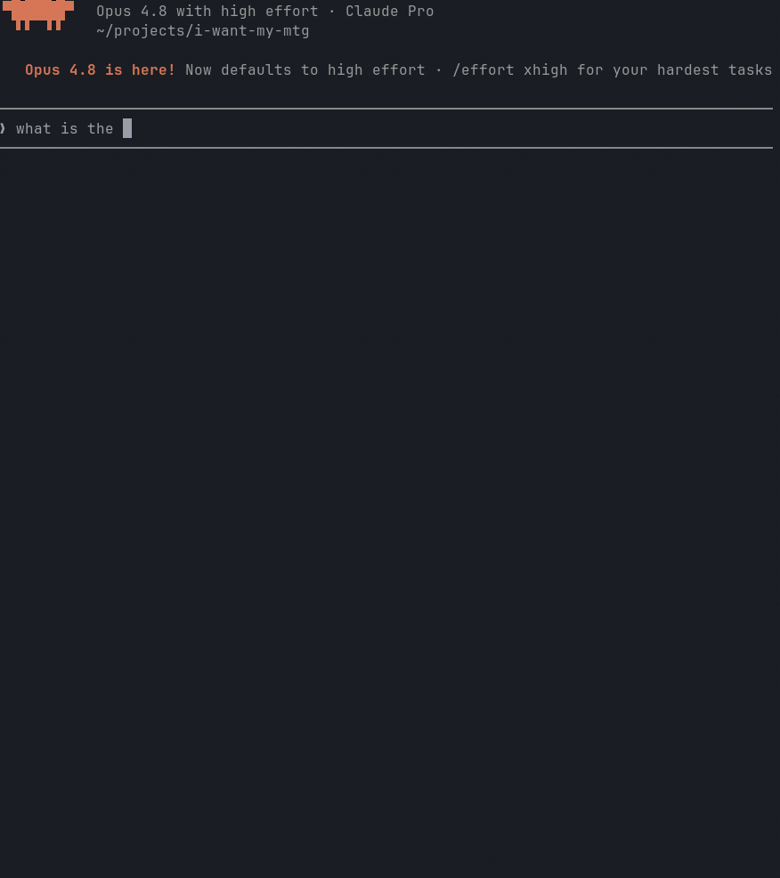

# iwantmymtg-mcp

[](https://www.npmjs.com/package/iwantmymtg-mcp)
[](LICENSE)
[](https://smithery.ai/servers/matthewdtowles/iwantmymtg-mcp)

An [MCP](https://modelcontextprotocol.io) server for [I Want My MTG](https://iwantmymtg.net). Exposes IWMM's API as tools so Claude Desktop, Claude Code, Cursor, and other MCP clients can search Magic: The Gathering cards/sets and manage a user's collection conversationally.

> Published on [npm](https://www.npmjs.com/package/iwantmymtg-mcp), the [MCP Registry](https://github.com/modelcontextprotocol/registry), and [Smithery](https://smithery.ai/servers/matthewdtowles/iwantmymtg-mcp). Coverage expands to match the API; see [`docs/TOOLS.md`](docs/TOOLS.md) for the full, always-current tool list.



## What you can do

- **Anonymous (no key):** search cards, look up a card by set+number, get current prices and 30-day price history, get a card's buylist (sell-to-vendor) offers, list sets and their cards, list sealed products.
- **Authenticated (with an IWMM API key):** manage your inventory and transactions; view portfolio summaries, history, performance, cash flow, realized gains, and breakdowns; manage price alerts and notifications.
- **Sell tools (with a key):** see your collection's market sell value (best buylist offer per card, grouped by vendor), manage a buy-list (want-list), and get a cash-vs-store-credit recommendation for selling toward your buy list.

See the [project roadmap](https://github.com/matthewdtowles/i-want-my-mtg/blob/main/ROADMAP.md#43-mcp-server--agentic-ai-integration) for what's next.

## Install

Requires Node 20+.

```bash
npx iwantmymtg-mcp
```

Or install globally if you prefer:

```bash
npm install -g iwantmymtg-mcp
iwantmymtg-mcp
```

## Claude Desktop

Add to `claude_desktop_config.json` (macOS: `~/Library/Application Support/Claude/claude_desktop_config.json`; Windows: `%APPDATA%\Claude\claude_desktop_config.json`):

```json
{
  "mcpServers": {
    "iwmm": {
      "command": "npx",
      "args": ["-y", "iwantmymtg-mcp"],
      "env": {
        "IWMM_API_KEY": "iwm_live_..."
      }
    }
  }
}
```

`IWMM_API_KEY` is optional - read-only tools work without it. Create a key at https://iwantmymtg.net/user/api-keys.

## Claude Code

Add to `.mcp.json` in your project (or `~/.claude/.mcp.json` globally):

```json
{
  "mcpServers": {
    "iwmm": {
      "command": "npx",
      "args": ["-y", "iwantmymtg-mcp"],
      "env": { "IWMM_API_KEY": "iwm_live_..." }
    }
  }
}
```

## Cursor

Add to `~/.cursor/mcp.json` (global) or `.cursor/mcp.json` in your project:

```json
{
  "mcpServers": {
    "iwmm": {
      "command": "npx",
      "args": ["-y", "iwantmymtg-mcp"],
      "env": { "IWMM_API_KEY": "iwm_live_..." }
    }
  }
}
```

After saving, restart Cursor and confirm `iwmm` appears under **Settings -> Features -> MCP Servers**.

## Example prompts

- "Search for Lightning Bolt printings and show me the cheapest one."
- "What's the price history of Bloodbraid Elf from Modern Horizons 3?"
- "Add 4 copies of Lightning Bolt LEA to my inventory."
- "What sealed products are available for MH3?"
- "What's my collection worth to sell right now, and which vendor pays most?"
- "Add these cards to my buy list, then tell me whether cash or store credit is the better deal."

See [`examples/`](https://github.com/matthewdtowles/iwantmymtg-mcp/tree/main/examples) for walkthroughs of common flows, and [`docs/TOOLS.md`](docs/TOOLS.md) for the full tool reference.

## Configuration

| Env var | Default | Purpose |
|---|---|---|
| `IWMM_API_KEY` | _(unset)_ | Personal API key. Required only for authenticated tools. |
| `IWMM_BASE_URL` | `https://iwantmymtg.net` | Override for self-hosted or local-dev IWMM instances. |

## Local development

```bash
npm install
npm run build
node dist/index.js
```

Or with `tsx` for live reload:

```bash
npm install
npx tsx src/index.ts
```

## License

This project is licensed under the MIT License — see the [LICENSE](LICENSE) file for details.
